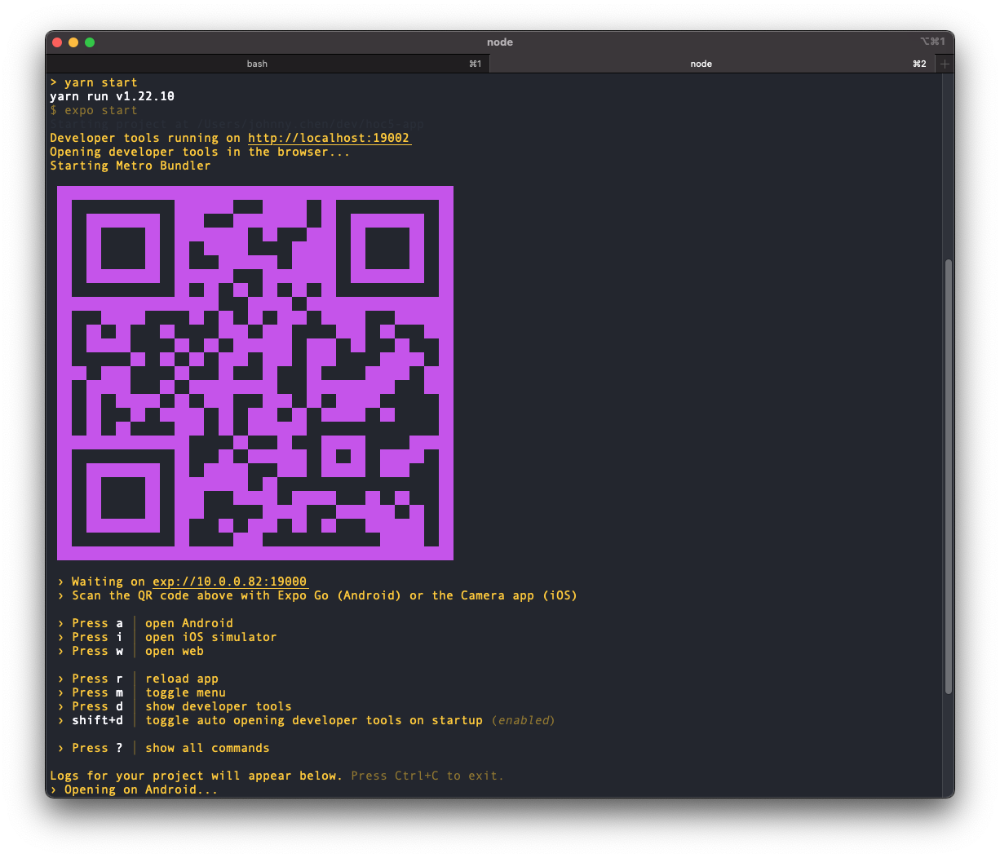

# :church: hoc5-app :church:

# Introduction
TODO

# :hammer: Development
## Setup environment on MacOS
### Install [iterm2](https://iterm2.com/)
This is a way better terminal than `terminal`, the terminal that comes with MacOS.
> To install
> * Download the package from https://iterm2.com/ and install

### Install [git](https://git-scm.com/book/en/v2/Getting-Started-Installing-Git) 
Git is used for source control. Git can be installed when you install XCode Command Line Tools
```bash
# Open up a terminal and typing git will cause XCode installation to start
$ git --version
```

### Install [homebrew](https://brew.sh/) 
Homebrew is a package manager for MacOS and a convenient way to install programs
on MacOS.
```bash
$ /bin/bash -c "$(curl -fsSL https://raw.githubusercontent.com/Homebrew/install/HEAD/install.sh)"
```

### Install [watchman](https://facebook.github.io/watchman/docs/install#buildinstall)
Watchman is used by Expo to watch your source files. As you change the source code, watchman 
will let Expo know and automatically load these changes in your running app. You can just 
write a change and save and it'll show up on your app (that's running on the Expo app).
```bash
$ brew install --HEAD watchman
```

### Install [nodejs](https://nodejs.org/en/)
Node is a Javscript runtime environment. Your app's javascript code is running
in this environment.
> To install
> * Goto https://nodejs.org/en/ and download the MacOS package
> * Open the `.pkg` file and follow installation steps

### Install [yarn](https://classic.yarnpkg.com/en/docs/install#mac-stable)
Yarn is a package manager for Javascript code. We will install our app dependencies
using this tool.
```bash
$ brew install yarn
```

### Install [vscode](https://code.visualstudio.com/download)
Vscode is your code editor and you'll be spending a lot of time in here. 
> To install
> * Goto https://code.visualstudio.com/download 
> * Open package and install

### Install [expo-cli](https://docs.expo.io/get-started/installation/)
Expo is the react-native framework we're using.
```bash
$ npm install --global expo-cli
```

Verify that the installation was successful by running `expo whoami`. You're not 
logged in yet, so you will see "Not logged in". You can create an account by 
running `expo register` if you like, or if you have one already run `expo login`, 
but you also don't need an account to get started.

### Install [Expo Go](https://play.google.com/store/apps/details?id=host.exp.exponent) app on your phone
We will be using this to run our apps, and only use a simulator if we're desperate.
* Go find `Expo Go` in the app store for your device and install

# :runner: Run
## Running on Expo
During development, we'll be primarily running our app's using the Expo app on our phone.
The app will be hosted on our local machines and then rendered on our devices through the Expo app.

#### Start Expo and host your app
```bash
# Goto our source directory
$ cd hoc5-app 

# Host the app
$ expo start
```

#### Open the app on your device
> * Open up Expo on your device
> * Scan the QR code showing up in the terminal in which you ran `expo start`
> * And Voila! you should see your app loaded
> * Make changes to your source, like `App.tsx`, and you'll see changes automaticaly show up.
 


# :flying_saucer: Distribute

# :art: Design

## Dependencies
### react-native-navigation
TODO

### [expo-template-bare-typescript](https://www.npmjs.com/package/expo-template-bare-typescript)
Starting template for `hoc5-app` that sets up a typescript environment

